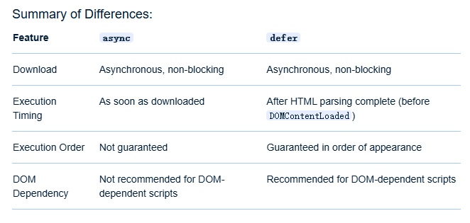

async vs defer vs preload

<!--more-->

## 正常流程


## async


## defer


### summary



## preload
```html
<link rel="preload" href="example.css" as="style">
```
仅对资源标签生效，作为一个标志，告知浏览器优先下载一些后续会用到的重要css、字体、图片等资源。

::: tip
preload 可不可以与 async 和 defer 一起使用？当然是可以的，但是没必要！  
因为加了 async/defer 就已经是并行下载了，没必要再指定优先下载了。
:::
